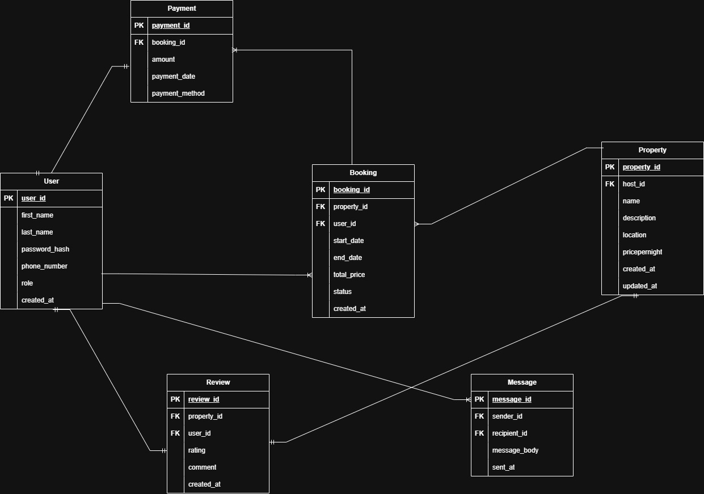

# Entity-Relationship Diagram: Airbnb Clone

## Entities and Attributes
cc
### User
- user_id (PK)
- name
- email
- password
- created_at
- updated_at

### Property
- property_id (PK)
- host_id (FK to User)
- name
- description
- location
- price_per_night
- created_at
- updated_at

### Booking
- booking_id (PK)
- user_id (FK to User)
- property_id (FK to Property)
- start_date
- end_date
- total_price
- status
- created_at
- updated_at

## Relationships
- One `User` can host many `Properties`.
- One `User` can make many `Bookings`.
- One `Property` can have many `Bookings`.
- Each `Booking` belongs to one `Property` and one `User`.

## ERD Image

